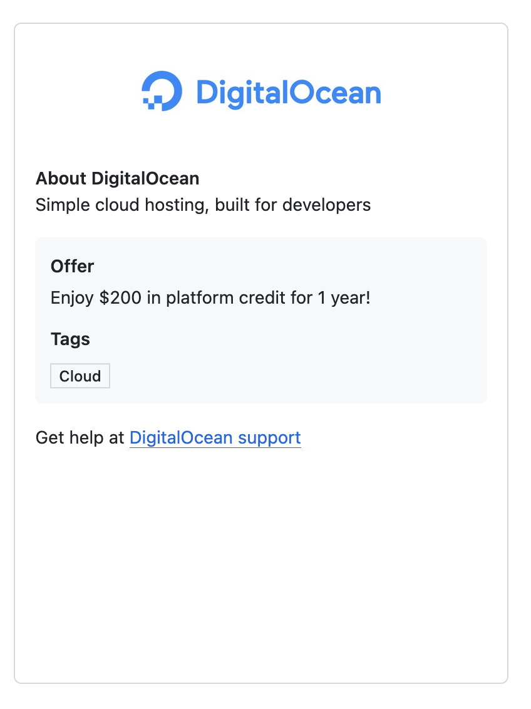

# 2026-02-26

## Notetakers

* section 1: Thomas Fowler
* section 2: Alex Nguyen

## CLOUD: Deploying your LocalLibrary

1. If you haven't completed Prep 05, you must do part of it right now:
    1. [requirements file](https://w3.cs.jmu.edu/cs347/s26/prep/05/#requirements-file)
        1. It looks like y'all likely don't have `django-ninja` in your `requirements.txt`. here's mine at this point:
        ```txt
        Django~=5.2
        django-environ~=0.12
        django-ninja~=1.5
        ```
    2. [env file](https://w3.cs.jmu.edu/cs347/s26/prep/05/#env-files)
2. **ONLY AFTER YOU HAVE DONE THE ABOVE**, Make a few updates to your locallibrary:
    1. env
        ```
        DJANGO_SECRET_KEY=gdsfawkhjgeskv8ua3jhufs3a8j9ke2j3isfhj4gryhfej
        DJANGO_ALLOWED_HOSTS=127.0.0.1,localhost
        DJANGO_DEBUG=True
        DJANGO_DATABASE_URL=sqlite:///db.sqlite3
        DJANGO_SUPERUSER_USERNAME="me"
        DJANGO_SUPERUSER_PASSWORD="me"
        DJANGO_SUPERUSER_EMAIL="me@me.me"
        DJANGO_TIME_ZONE=America/New_York
        ```
    2. settings
        ```python
        # ...

        import sys

        # ...

            # SECURITY WARNING: keep the secret key used in production secret!
            SECRET_KEY = env.str("DJANGO_SECRET_KEY", default="django-insecure-voj5u4t68$8rcz9xg1cysr2rt=fyxx&@=x$arh!dajf()!6!14")

            # SECURITY WARNING: don't run with debug turned on in production!
            DEBUG = env.bool("DJANGO_DEBUG", default=False)

            ALLOWED_HOSTS = env.list("DJANGO_ALLOWED_HOSTS", default=[])

            # ...
            if len(sys.argv) > 0 and sys.argv[1] != 'collectstatic':
                DATABASES = {
                    'default': env.db("DJANGO_DATABASE_URL"), # raises ImproperlyConfigured exception if not found
                }

            # ...

            TIME_ZONE = env.str("DJANGO_TIME_ZONE", default="UTC")

            # ...

            STATIC_URL = "/static/"
            STATIC_ROOT = os.path.join(BASE_DIR, "staticfiles")
        ```
    3. requirements.txt add `gunicorn`
        1. (then pip install again)
        ```sh
        pip install -r requirements.txt
        ```
    4. locally, try the command that the server will be doing (except make the `/dev/shm` be a directory that exists on your local machine)
        ```sh
        gunicorn --worker-tmp-dir /dev/shm locallibrary.wsgi
        ```
3. commit and push your code back to the repo
4. FORK
    1. DO App Platform is a compromise... 
    2. fork the repo in github to your own username
        1. the issue is digital ocean's means of accessing your code is problematic for our use case, so by having a fork of the repo that is not in our course's github org, we simplify permissions
5. **DON'T MESS THIS UP** google is not involved in this. 
    1. get digital ocean via github student pack
    2. go to [github student developer pack](https://education.github.com/pack)
        1. sign in 
        2. go to it again https://education.github.com/pack
    3. scroll down to digitalocean
        1. If it looks like this, you have not succeeded!
        
        2. else if it has the link that's not pictured here, click it and authenticate via github and add your payment method (the credit card will be charged $5, idk what happens with paypal, maybe it's not charged money?)
        3. in digital ocean control panel, try very hard to convince it that you'd like to scroll the left sidebar down until you see `Billing`, click billing
        4. scroll to bottom of billing
        5. confirm you see your $200 of promo credit
6. proceed with [deploying django to digitalocean via app platform from Step 4](https://www.digitalocean.com/community/tutorials/how-to-deploy-django-to-app-platform#step-4-mdash-deploying-to-digitalocean-with-app-platform)
    1. EXCEPT: your environment variables are those defined in your env file, add them in digitalocean instead of the ones pictured in step 4
    2. EXCEPT AGAIN: DJANGO_ALLOWED_HOSTS --> ${APP_DOMAIN}


## Eventually
1. DO Droplet version https://www.digitalocean.com/community/tutorials/how-to-set-up-django-with-postgres-nginx-and-gunicorn-on-ubuntu

### Notes

1. **Source $5 for DigitalOcean by Thursday (via credit card or paypal)**
    Possibility of Using Droplet -> VM